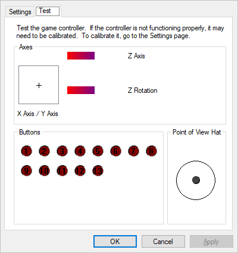
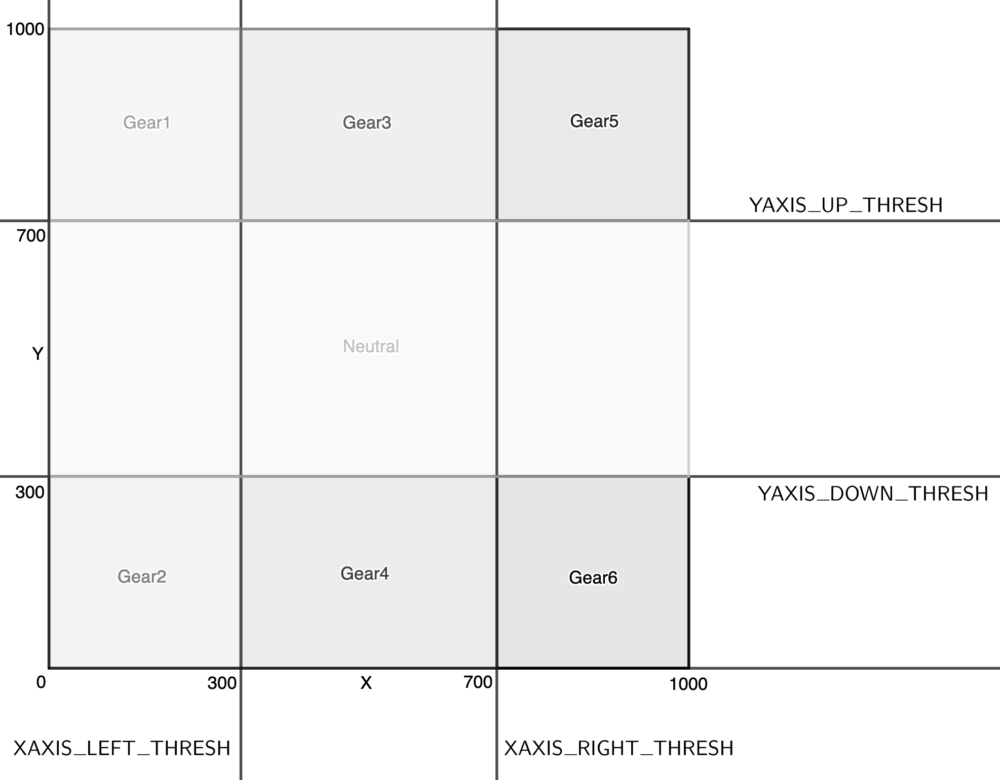

# Logitech Driving Force Shifter USB Adapter

Project to turn an Arduino board into a USB adapter for the Logitech G29 Driving Force Shifter.

Inspired by [this project](https://github.com/armandoiglesias/g29Shifter) and [this video](https://www.youtube.com/watch?v=dLpWEu8kCec). Code rewritten to use the [ArduinoJoystickLibrary](https://github.com/MHeironimus/ArduinoJoystickLibrary) library.

## Prerequisites

* A [Logitech Driving Force shifter](https://www.logitechg.com/en-us/products/driving/driving-force-shifter.941-000119.html).
* An Arduino Leonardo, Micro, or Due.
* The [Arduino IDE](https://www.arduino.cc/en/Main/Software).
* The [ArduinoJoystickLibrary](https://github.com/MHeironimus/ArduinoJoystickLibrary).

## Arduino setup

Connect the pins from the shifter's serial connector to the Arduino:


More details can be found in [this video by AMStudio](https://www.youtube.com/watch?v=dLpWEu8kCec). It also shows how the finished product should look like, though the code base is different.

## Flashing

1. Download the [ArduinoJoystickLibrary](https://github.com/MHeironimus/ArduinoJoystickLibrary) library.
2. In the Arduino IDE, select `Sketch` > `Include Library` > `Add .ZIP Library...`, browse to where the downloaded ZIP file is located, and click `Open`.
3. Flash `G29_Shifter.ino` to your Arduino.

Make sure to watch [this video by AMStudio](https://www.youtube.com/watch?v=dLpWEu8kCec) and read the [instructions from the ArduinoJoystickLibrary](https://github.com/MHeironimus/ArduinoJoystickLibrary#installation-instructions) for more details.

## Testing

Once you have flashed your Arduino, if you're running Windows, you can check that the gears are working correctly from the control panel:

* Open Control Panel from the Start Menu.
* Under "Hardware and Sound", click "View devices and printers".
* The Arduino board should appear as a gamepad controller. Right click it and select the UnoJoy Joystick's properties.
* Select "Properties". You should be able to view the gamepad's active buttons in the "Test" tab.



Try to switch into each gear and check that they are correctly recognized. The first gear should show up as button 1, the second gear as button 2, and so on and so forth. The reverse gear should show up as button 7.

If that's not the case, please checkout the "Debugging" section.

## Debugging

### Shifter not recognized by the system

Make sure you have correcty programmed the Arduino using the `ArduinoJoystickLibrary`. Also make sure your board is [supported by the ArduinoJoystickLibrary](https://github.com/MHeironimus/ArduinoJoystickLibrary/wiki/Supported-Boards)

### Wrong gears detected

If the wrong buttons are selected when you shift gears (e.g. gear 1 enables button 3, or gear 6 enables button 4), the thresholds are probably wrong. You need to recalibrate the values as they depend on your setup (e.g. length of the cables between the shifter and the Arduino).

You'll need to open `G29_Shifter.ino` and change the following values:

```C
#define XAXIS_LEFT_THRESH
#define XAXIS_RIGHT_THRESH
#define YAXIS_UP_THRESH
#define YAXIS_DOWN_THRESH
```

Here's how the thresholds work:



When the gear is perfectly centered (in neutral), its X and Y values should be around 500. If the X value goes under `XAXIS_LEFT_THRESH` (300 by default), then you are probably switching into first or second gear. At the contrary, if it goes above `XAXIS_RIGHT_THRESH`, you are probably switching into fifth, sixth, or reverse.

Here are a few examples of symptoms and how to fix them:

* *I'm in 3rd gear but the input shows up as 1rst gear*: Decrease the `XAXIS_LEFT_THRESH`.
* *I'm in 1rst gear but the input shows up as 3rd gear*: Increase the `XAXIS_LEFT_THRESH`.
* *I'm in 3rd gear but the input shows up as neutral*: Decrease the `YAXIS_UP_THRESH`.
* *I'm in 4th gear but the input shows up as neutral*: Increase the `YAXIS_DOWN_THRESH`.

To know which values you should use, you can flash `Test_Arduino_Shifter.ino` and observe the values read by opening the serial port in the Arduino IDE (baud rate is 9600).

### No gear detected

Check your wiring. Make sure to watch [this video by AMStudio](https://www.youtube.com/watch?v=dLpWEu8kCec) which explains precisely how to connect the shifter to the Arduino.

Flash `Test_Arduino_Shifter.ino` to your Arduino board and make sure that the outputs on the serial port change when you switch gears. Check that those values are coherent with the defined thresholds (see above).
