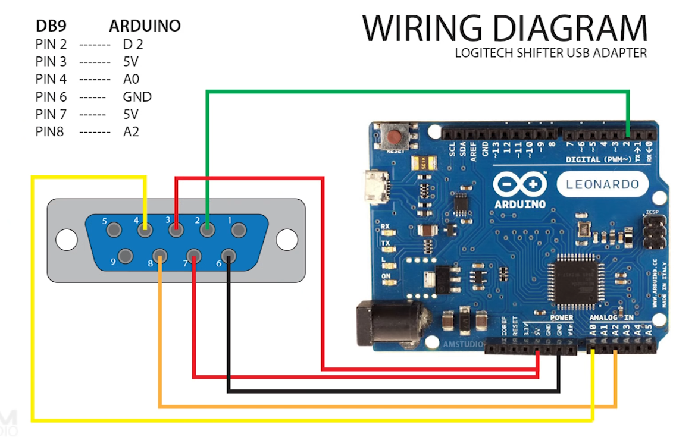

# Logitech Driving Force Shifter USB Adapter

Project to turn an Arduino board into a USB adapter for the Logitech G29 Driving Force Shifter.

Inspired by [this project](https://github.com/armandoiglesias/g29Shifter) and [this video](https://www.youtube.com/watch?v=dLpWEu8kCec). Code rewritten to use the [UnoJoy](https://github.com/AlanChatham/UnoJoy) library and work on a non-Leaonardo board.

## Prerequisites

* A [Logitech Driving Force shifter](https://www.logitechg.com/en-us/products/driving/driving-force-shifter.941-000119.html).
* An Arduino Uno, Mega, or Leonardo.
* The [Arduino IDE](https://www.arduino.cc/en/Main/Software).

## Arduino setup

Connect the pins from the shifter's serial connector to the Arduino:

More details can be found in [this video by AMStudio](https://www.youtube.com/watch?v=dLpWEu8kCec). It also shows how the finished product should look like, though the code base is different.

## Flashing

Download the [UnoJoy](https://github.com/AlanChatham/UnoJoy) library and drivers, and flash `G29_Shifter.ino` to your board.

Make sure to read UnoJoy's project page, which describes the steps to flash your Arduino, and turn it into a gamepad recognized by your computer.
